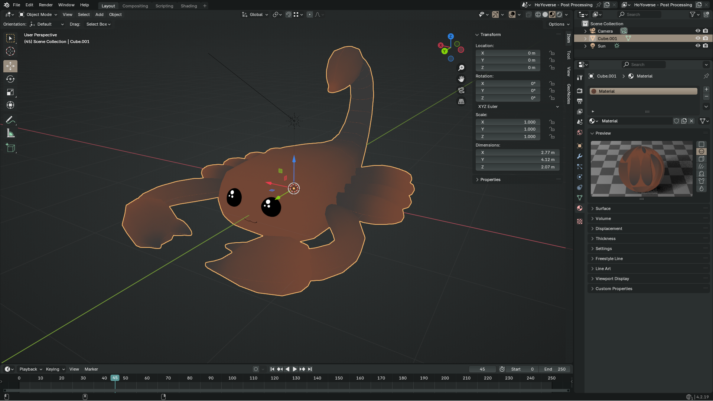

<h1>DarkGold Theme for Blender 3.0+</h1>

This is the very basic theme that I use in Blender, it was made in Blender 3.0 but should work fine with later versions.

<h2>Installation:</h2>

To install themes in Blender 3.0 and later is simple.

<ol>

<li>Click on <b>Edit</b> in the top bar, it's between <b>File</b> and <b>Render</b>.</li>
<li>Click on <b>Preferences</b>, a new window should open.</li>
<li>On the left, select <b>Themes</b>.</li>
<li>Click on <b>Install...</b> a file dialog window should open.</li>
<li>Locate the <a href="DarkGold.xml">DarkGold.xml</a> file and open it.</li>
  
</ol>

<h2>Alternative Installation:</h2>

Another way to install themes is to copy the <a href="DarkGold.xml">DarkGold.xml</a> file and paste it into your <b>%appdata%\Blender Foundation\Blender\3.0\scripts\presets\interface_theme</b> directory.

<b>Note:</b> This directory might not exist until you install a theme through the preferences menu, but you can also manually create these directories if need be.

And that's it.

I hope you like it.

<h2>License:</h2>

<a href="LICENSE">GPL-3.0</a>
